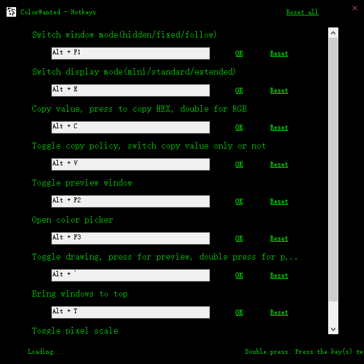

# ColorWanted

这是一个**Windows**平台使用的屏幕取色器工具。支持**RGB**、**HSL**、**HSB/HSV**、**HSI**颜色空间。

有任何意见或建议，欢迎通过[issue](https://github.com/hyjiacan/ColorWanted/issues/new)提出

## 运行环境 

- WindowsXP [(2.6.1及之前的版本) .NET Framework 4.0](http://www.microsoft.com/zh-cn/download/details.aspx?id=17718)    
- Windows7及更高版本 [(2.6.2及之后的版本) .NET Framework 4.5.2](https://www.microsoft.com/zh-CN/download/details.aspx?id=42642)

备注:由于[Github 升级SSL协议到 Tls12](https://blog.github.com/2018-02-23-weak-cryptographic-standards-removed/)(发生在2018年2月)，
导致使用.net4.0不能再支持自动更新功能，所以**从版本2.6.2开始，不再支持.net4.0，也就不再支持WindowsXP**

# 源码&下载

- [源码](https://github.com/hyjiacan/ColorWanted)
- [稳定版](https://github.com/hyjiacan/ColorWanted/releases)
- [开发版](https://github.com/hyjiacan/ColorWanted/blob/master/ColorWanted/bin/Release/ColorWanted.exe?raw=true)
- [2.6.1.2](https://github.com/hyjiacan/ColorWanted/blob/84255e2ff5a5cef4f6b70c2efbebbcee981ddb65/ColorWanted/bin/Release/ColorWanted.exe?raw=true)

# 使用说明

程序启动后，有两个窗口：一个颜色值显示窗口，一个取色放大预览窗口。

窗口位置和选项的改变（包括通过快捷键引起的改变）会实时保存在配置文件中，可以通过托盘**配置文件**菜单项打开查看。

- **颜色值显示窗口**
当前光标所在处的颜色值，这个窗口可以显示以下颜色类型:
- RGB(十六进制)
- RGB(十进制)
- [HSL](https://baike.baidu.com/item/HSL)
- [HSB](https://baike.baidu.com/item/hsb)
- [HSI](https://baike.baidu.com/item/HSI)

其中，除了RGB颜色，其它类型可以设置是否显示（可以通过托盘菜单或快捷键**Alt+E**）

- **取色放大预览窗口**
当前光标所在处为中心，向上下左右四个方向各取**5**个像素（即宽高均为**11**个像素），然后通过像素放大再呈现到这个窗口上。
这个窗口支持鼠标滚轮缩放：
在点击这个窗口后，鼠标滚轮向上即可放大窗口；向下即可缩小窗口。

- **调色板**
在打开调色板后，如果剪贴板中有已经复制的颜色，那么这个颜色会被作为调色板的初始颜色。
另外，调色板支持**保存自定义颜色**(仅点击**确定**时才会保存)，下次再打开程序，这些颜色会自动加载到调色板。
在点击**确定**时，会将调用板上选中的颜色的**十六进制值**放到剪贴板中。

- **复制策略**
在复制颜色值时，可以通过设置**复制策略**来控制是否仅仅复制颜色的值。
在仅复制值时，对**HEX**来说，就只会复制十六进制**FFFFFF**，而不会有前面的**#**符号。
对**RGB**来说，就只会复制**255,255,255**，而不会有**RGB()**符号。
此策略可以通过托盘菜单进行**HEX**和**RGB**的单独切换，
也可以通过按下全局快捷键**Alt+V**一起切换。在使用快捷键时，切换的依据是**HEX**值的策略，即先切换**HEX**值的策略，再让**RGB**的策略与其一致。

## 快捷键

> **双击** 1秒内连续按下两次快捷键

- **Alt+C** 复制十六进制格式,双击复制RGB格式
- **Alt+V** 切换颜色复制策略，控制是否仅复制颜色值
- **Alt+E** 切换显示模式(迷你/标准/扩展)
- **Alt+F1** 切换窗口模式(隐藏/固定/跟随)
- **Alt+F2** 显示/隐藏预览面板(预览面板会将光标所在处以及附近的像素**放大5倍**显示)
- **Alt+F3** 打开调色板
- **Alt+`** 暂停/开始绘制预览窗,双击暂停/开始取色
- **Alt+T** 把窗口显示到最顶层，这在取色窗口被其它程序遮挡时使用
- **Alt+P** 切换使用像素放大算法预览

> 以上是*默认*的快捷键，可以通过托盘的**快捷键**菜单，打开快捷键设置窗口来更改。

在预览窗口点击鼠标右键，可以开启/暂停预览功能

## 截图

> 获取屏幕上光标所在处像素的颜色，取色窗口显示了十六进制和RGB格式的颜色值。在预览窗口上，有将每个像素放大5倍的预览。

> 
如果相邻几个像素点颜色有差异，想要精确获取某个像素点的颜色，那么可以在此时按下快捷键 **Alt+`**，以使预览面板会停止绘制，此时将鼠标放到预览面板上，就可以方便地获某个像素的颜色了。

> 完整的快捷键自定义

> 取色历史，无论是屏幕取色，还是调色板取色，都会记录起来

## 开源协议

这个东西遵守[GPL V3](http://www.gnu.org/licenses/gpl-3.0.html)，版权受法律保护，请自爱自律。

## 感谢

- [取色功能](http://www.haolizi.net/example/view_102.html)
- [窗口拖动功能](http://blog.csdn.net/skysky01/article/details/9902247)
- [全局热键](http://www.cnblogs.com/Randy0528/archive/2013/02/04/2892062.html)
- [在Alt+Tab列表中隐藏窗口](http://bbs.csdn.net/topics/380256152#post-390885609)
- [使用Windows API写剪贴板](http://www.cnblogs.com/wind-net/archive/2012/11/01/2749558.html)
- [C++数据类型与C#数据类型对应](http://www.cnblogs.com/chuncn/archive/2011/12/20/2294096.html)
- [快捷键输入](http://www.jb51.net/article/60257.htm)
- [RGB转换到HSB/HSL](http://blog.csdn.net/jiangxinyu/article/details/8000999)    
- [RGB转换到HSI](http://blog.csdn.net/yangleo1987/article/details/53171623)